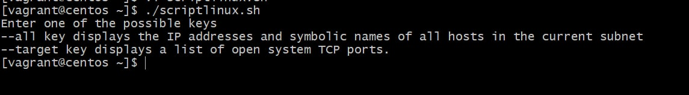
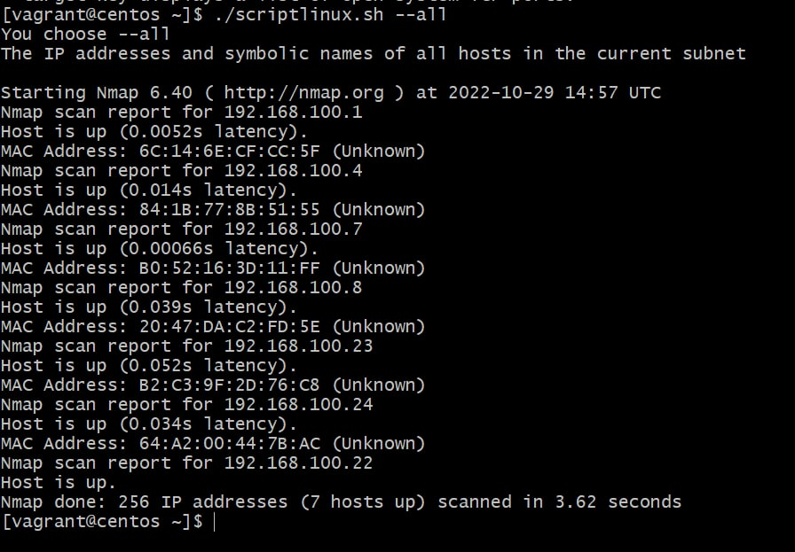
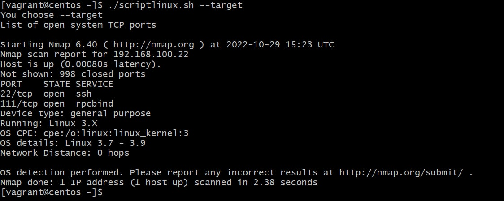
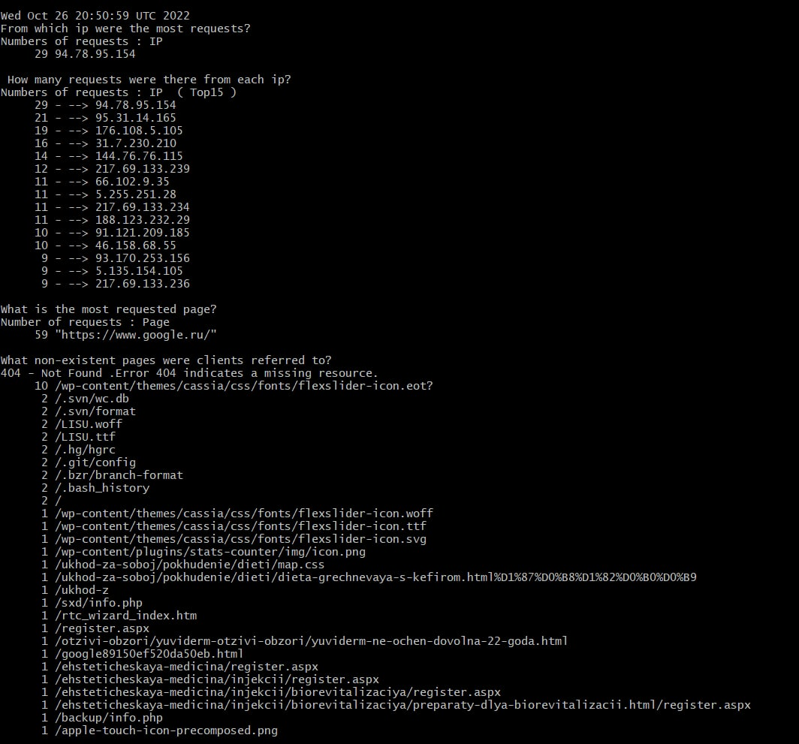
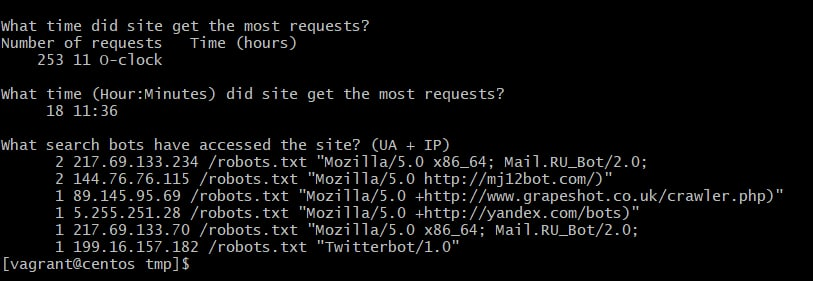
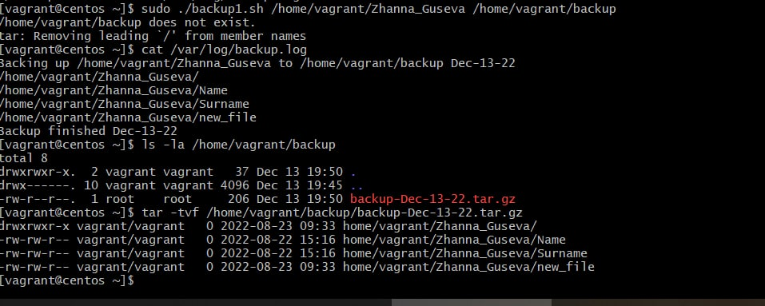

## Linux administration with bash. Home task

### A. Create a script that uses the following keys:
1. When starting without parameters, it will display a list of possible keys and their description.

 

2. The --all key displays the IP addresses and symbolic names of all hosts in the current subnet

 

3. The --target key displays a list of open system TCP ports.
The code that performs the functionality of each of the subtasks must be placed in a separate function

 


Script for Centos 7  with nmap distribution installed and executed:
```bash
#! /bin/bash

hosts_ip(){
SUB1=`ip a | grep eth1 | grep inet | awk '{print $2}'`
  sudo nmap -sn $SUB1   
}
 
open_ports(){
 SUB2=`ip a | grep eth1 | grep inet | awk '{print $2}' | cut -d/ -f1`
  sudo nmap -sT -O $SUB2
}  

case "$1" in
  --all)
    echo "You choose --all"
	echo "The IP addresses and symbolic names of all hosts in the current subnet"
    hosts_ip
	;;
  --target)
    echo "You choose --target"
    echo "List of open system TCP ports"
    open_ports    
	;;
  *)
    echo "Enter one of the possible keys"
    echo "--all key displays the IP addresses and symbolic names of all hosts in the current subnet"
	echo "--target key displays a list of open system TCP ports."
	;;
esac
```
### B. Using Apache log example create a script to answer the following questions:

1. From which ip were the most requests?
2. How many requests were there from each ip?
3. What is the most requested page?
4. What non-existent pages were clients referred to?



5. What time did site get the most requests?
6. What search bots have accessed the site? (UA + IP)



Script for Centos 7:
```bash
#! /bin/bash
echo `date`
	
echo "From which ip were the most requests?"
echo "Numbers of requests by IP"

awk '{ print $1}' /tmp/test.log | sort | uniq -c | sort -nr | head -n 1
	
echo -en '\n'
echo " How many requests were there from each ip? "
echo "Numbers of requests : IP  (Top 15)"

awk '{print $2 " --> " $1}' /tmp/test.log | sort | uniq -c | sort -nr |  head -n 15
	
echo -en '\n'
echo "What is the most requested page? "
echo "Number of requests : Page"

awk {'print $11'} /tmp/test.log | sort | uniq -c | sort -nr | grep "http" | head -n 1

echo -en '\n'
echo "What non-existent pages were clients referred to? "
echo "Requests with 404 error - indicates a missing resource"

cat /tmp/test.log | awk '($9 ~ /404/)' | awk '{ print $7 }' | sort | uniq -c | sort -rn
	
echo -en '\n'
echo "What time did site get the most requests?"
echo "Number of requests :  Time (hours)"

grep "25/Apr/2017" /tmp/test.log | cut -d[ -f2 | cut -d] -f1 | awk -F: '{print $2 }' | uniq -c | sort -nr | head -n 1

echo "What time (Hour : Minutes) did site get the most requests?"
grep "25/Apr/2017" /tmp/test.log | cut -d[ -f2 | cut -d] -f1 | awk -F: '{print $2 ":" $3}' | uniq -c | sort -nr | head -n 1
	
echo -en '\n'
echo "What search bots have accessed the site? (IP + UA)"

awk '{print $1 " " $7 " " $12 " " $15 " " $16 }' /tmp/test.log | sort | uniq -c | sort -fr | grep "robots"
```
### C. Create a data backup script that takes the following data as parameters:
1. Path to the syncing directory.
2. The path to the directory where the copies of the files will be stored.

The command to run the script must be added to crontab with a run frequency of one minute



```bash
#! /bin/bash

BACKUPTIME=`date +%b-%d-%y`  # recive current date

SOURCEFOLDER=$1  # Path to the syncing directory
DESTINATION=$2   # The path to destination directory

#Print start status message.
echo "Backing up $SOURCEFOLDER to $DESTINATION $BACKUPTIME" >> /var/log/backup.log

if [ -f "$DESTINATION" ]; then
    echo "$DESTINATION exists"
    tar -cvf $DESTINATION --listed-incremental= $DESTINATION.snar $SOURCEFOLDER >> /var/log/backup.log

else 
    echo "$DESTINATION does not exist."
    tar -cvzf $DESTINATION/backup-$BACKUPTIME.tar.gz $SOURCEFOLDER >> /var/log/backup.log
fi

echo "Backup finished $BACKUPTIME" >> /var/log/backup.log

chmod 755 /home/vagrant/backup1.sh
chown root:root /home/vagrant/backup1.sh
echo "*/1 * * * * root /home/vagrant/backup1.sh" >> /etc/crontab
```


